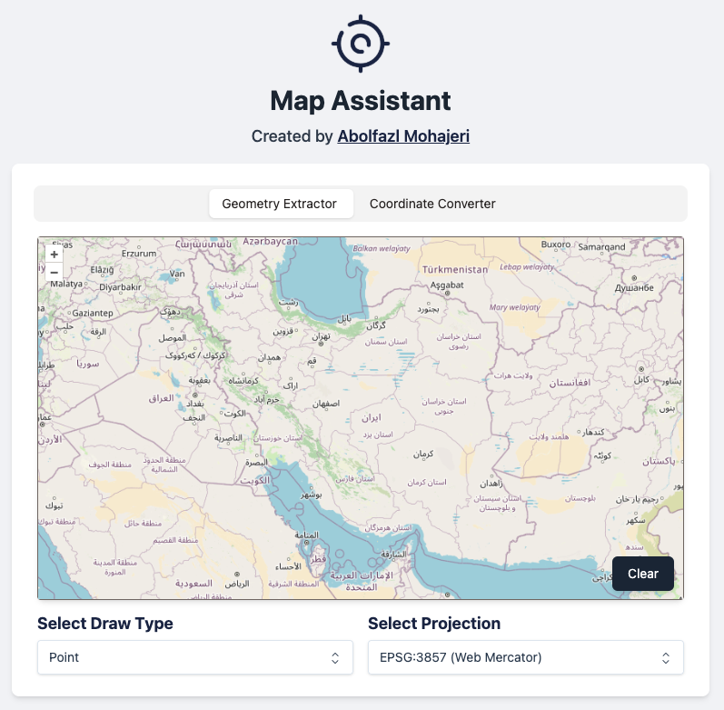

  

# Map Tools

**Map-Tools** is an online map assistant that provides utilities such as geometry extraction, coordinate conversion, and WKT (Well-Known Text) visualization. Whether you're a GIS professional, developer, or anyone working with spatial data, this tool makes these tasks easier and more efficient.

## Features

- **Geometry Extractor**: Draw and extract geometric data (Points, LineStrings, Polygons).
- **Coordinate Converter**: Convert coordinates between different projections (EPSG:3857, EPSG:4326).
- **WKT Viewer**: Visualize WKT representations of geometries on a map.

## Live Demo

🔗 [Try it Online](https://abmohajeri.github.io/map-tools)

## Contributing

Contributions are welcome! Feel free to fork the repo, submit issues, or create pull requests.

## Support

If you like this project, give it a ⭐ on GitHub!
