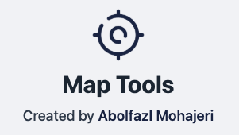

# Map Tools

**Map Tools** is an online assistant for working with maps, providing utilities such as geometry extraction, coordinate conversion, and WKT (Well-Known Text) visualization. This tool is ideal for GIS professionals, developers, and anyone working with spatial data.

## Features

- **Geometry Extractor**: Draw and extract geometric data (Points, LineStrings, Polygons).
- **Coordinate Converter**: Convert coordinates between different projections (EPSG:3857, EPSG:4326).
- **WKT Viewer**: Visualize WKT representations of geometries on a map.

## Live Demo

🔗 [Try it Online](https://abmohajeri.github.io/map-tools)

## Author

👤 **Abolfazl Mohajeri**\
🌐 [Website](https://abolfazlmohajeri.ir)\
🐙 [GitHub](https://github.com/abmohajeri)

## License

This project is licensed under the [MIT License](LICENSE).

## Contributing

Contributions are welcome! Feel free to fork the repo, submit issues, or create pull requests.

---

📌 **Support:** If you like this project, give it a ⭐ on GitHub!
